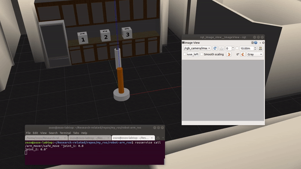

# ROS - Robot Arm
This is a ROS melodic workspace created on Ubuntu 18.04. The workspace is for the simulation of a simple robot arm built from scratch, includes sensors and control plugins, and incorporate the robot in a world file.

## Installation

- #### Prerequisite
    - You should have ROS melodic on your ubuntu 18.04.
    - All ROS dependency is satisfied.
    - Gazebo simulator is installed.

- #### Clone

    ```
    git clone https://github.com/Robotawi/robot-arm_ros.git
    ```

- #### Setup
    ```
    cd robot-arm_ros
    catkin_make
    source ./devel/setup.bash
    ```
## Package description
There are two nodes in this package. The first is for visual processing and the second is for safely moving the robot. If the robot's arm camera detects a uniform image, it is looking at the sky of gazebo, at the wall, or the floor. If this uniform image is detected, the robot is moved to a preset pose that look at the cubes.

The following shows two situations in which the robot is made to look at the key, and the floor and it reacts to such situations upon visul processing. The small window shows the camera output (topic).



**To launch the simulation environment:**
```
roslaunch simple_arm robot_spawn.launch
```
The system uses two topics to track the image seem by the arm camera, and to detect of the arm is stopped. The topics are /rgb_camera/image_raw and /simple_arm/joint_states

**To view the arm camera output run the following:**
```
rosrun req_image_view rqt_image_view
```
Then, se;ect the topic `/rgb_camera/image_raw` to visualize it.

If the arm is seeing a uniform grey image, and it is stopped (meaning looking up at the sky of gazebo), then it is tasked to move in another way. 

**To make the arm look up at the sky, we can call the service from the command line as follows:**
```sh
rosservice call /arm_mover/safe_move "joint_1: 0.0
joint_2: 0.0"
```
**To make it look up at the floor, use the following:**
```sh
rosservice call /arm_mover/safe_move "joint_1: 2.0
joint_2: 2.5"
```

If the sky or the floor are detected, the arm is moves to look at a predefined poses from which its camera sees the 1, 2, 3 cubes.


**Resources about how to make the robot model from scratch**
- [Gazebo ROS urdf](http://gazebosim.org/tutorials?tut=ros_urdf)
- [Gazebo in 5 mins] 001 - How To Launch Your [First Gazebo World Using ROS](https://www.youtube.com/watch?v=qi2A32WgRqI)

## To learn how to build world files
1. [http://gazebosim.org/tutorials?cat=build_world](http://gazebosim.org/tutorials?cat=build_world).
2. [Tutorial: Using roslaunch to start Gazebo, world files and URDF models](http://gazebosim.org/tutorials?tut=ros_roslaunch&cat=connect_ros).
3. Check what is inside gazebo [empty_world.launch](https://github.com/ros-simulation/gazebo_ros_pkgs/blob/kinetic-devel/gazebo_ros/launch/empty_world.launch) file. This file is has important defintions that are inherited by our created world. 

## Contact
In this project, I built everything from scratch because I love to understand how the internals of ROS work. This is a step towards my aim to actively contribute to robotics open-source software.

If you are interested in the presented work/ideas or if you have any questions, please feel free to connect with me on [LinkedIn](https://www.linkedin.com/in/mohraess). We can discuss about this project and other interesting projects.